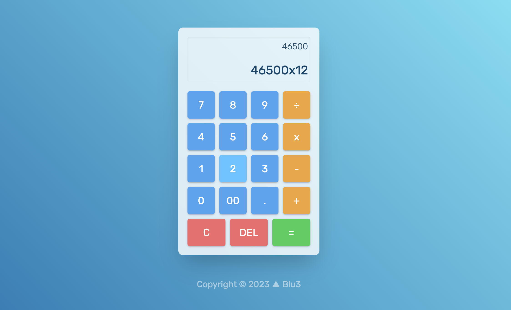

# Calculator #

Final project of the foundations course, a simple calculator made with HTML CSS and vanilla Javascript.
[Live Demo](https://blu3tan.github.io/calculator)

# Description #

- Chains multiple operations
- Evaluate only a pair of numbers at time
- Limits decimals length
- Accepts floating numbers
- Supports keyboard input
- Storing values and operations done with array methods

There are also subtle clicky sounds (i know is old school but still..)

----------------------------------------------------------------------------